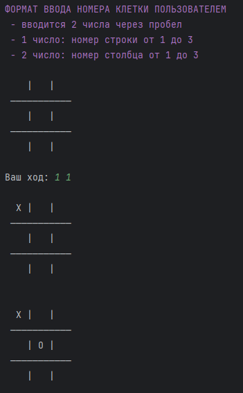
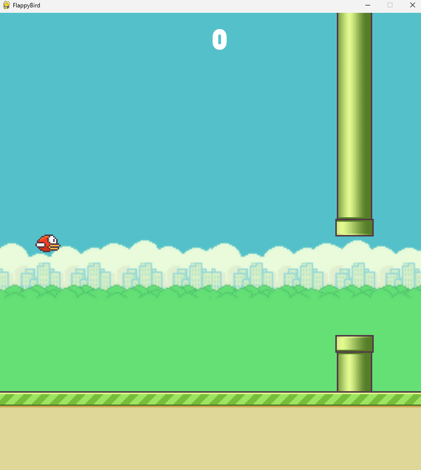
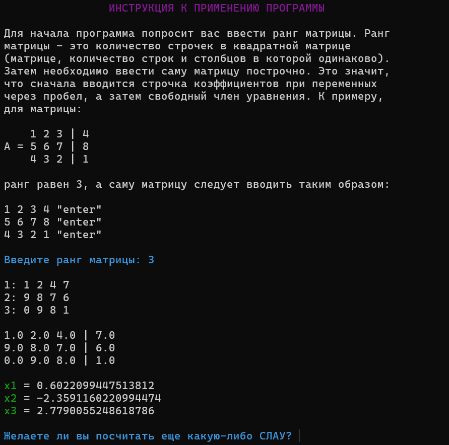

# Fundamental Python

This repository serves as a comprehensive resource for fundamental concepts and practices in Python programming. It is organized into various folders, each containing scripts and notes that cover different aspects of the language, from basic operations to advanced programming techniques like object-oriented programming (OOP). Below is an overview of the key directories and their contents.

## Directory Structure

### 1. `DAILY_WORK`
The `DAILY_WORK` folder is a workspace for everyday Python programming tasks. It includes `.py` files where you can:
- **Make Notes**: Jot down quick code snippets or ideas in Python as you work through problems or learn new concepts.
- **Fact-Checking**: Test and verify facts or code examples found online.
- **Drafts and Prototypes**: Create rough drafts or prototypes of programs before developing them further. This folder acts as a sandbox for experimentation and casual coding.

### 2. `IMPORTANT_PROGRAMMES`
This directory is organized into several subfolders, each containing more specific projects and scripts. It is a repository for programs that range from standalone projects to utilities that assist in the development of larger applications.

- **`final_prog`**:
  - This subfolder contains complete Python programs that can function as standalone projects. The primary focus is on Object-Oriented Programming (OOP), showcasing the versatility and wide-ranging applications of OOP in Python. These programs are diverse and demonstrate how OOP can be effectively utilized in different contexts. An example of program Tic-tac-toe:
  
    

- **`pygame_prog`**:
  - This folder houses various programs created using the [Pygame](https://pypi.org/project/pygame/) library. These scripts illustrate how to develop 2D games and graphical applications in Python, providing practical examples of game development fundamentals. For example there a flappy bird game:
  

- **`useful_prog`**:
  - Here is a collection of utility scripts that, while not suitable as standalone projects, are invaluable for simplifying and enhancing the development of other Python programs. These include helper functions, reusable components, and scripts that automate or streamline common tasks. For instance, here is the matrix counter implementation:
  

Additionally, this directory contains educational scripts that serve primarily as learning tools. While these may not be directly applicable in real-world projects, they are essential for understanding Python concepts and practices.

### 3. `LIBRARY`
The `LIBRARY` directory is divided into subfolders that focus on specific aspects of Python programming, providing detailed explanations and code examples.

- **`OOP`**:
  - This subfolder contains a comprehensive file that covers all major aspects of Object-Oriented Programming (OOP) in Python. It serves as a reference for understanding and implementing OOP principles in Python projects.
  - Another file in this subfolder specifically addresses the use of descriptors in Python, offering a deeper dive into this advanced OOP concept.

- **`base_operations`**:
  - This folder includes files that cover the most fundamental operations in Python, such as working with strings, numbers, lists, and other basic data types. These files are ideal for refreshing your memory on specific topics or for educational purposes. They offer concise, practical examples that are easy to follow and apply.

The `LIBRARY` directory also contains additional files that do not fit neatly into the above categories. For example, the `Decimal` file is dedicated to mathematical operations with large numbers that Python’s standard data types cannot handle accurately. This file is currently under development and represents an ongoing effort to expand Python’s capabilities in this area.

---

This repository is an essential toolkit for Python programmers at all levels. Whether you're brushing up on basic operations, exploring advanced OOP techniques, or developing your own projects, the `fundamental_python` repository provides a structured and comprehensive resource for your Python programming journey.
